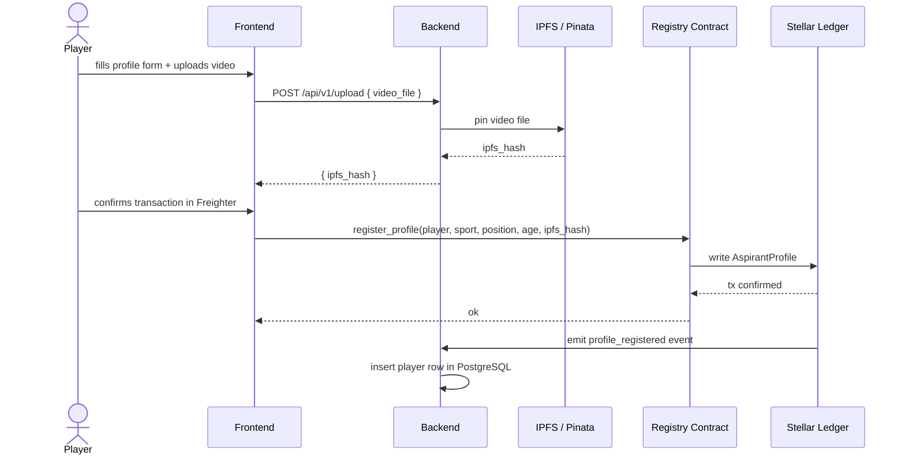
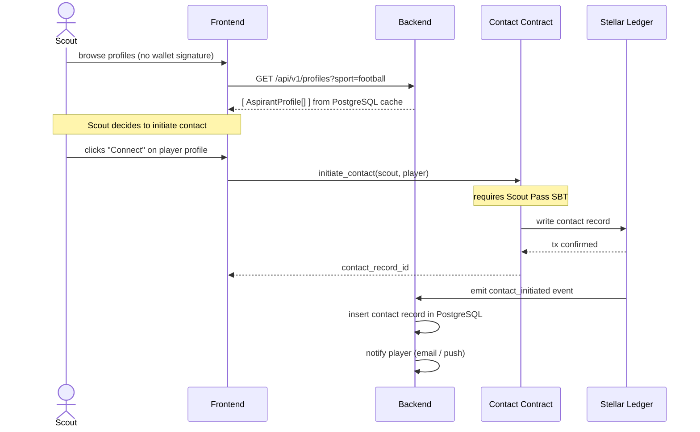
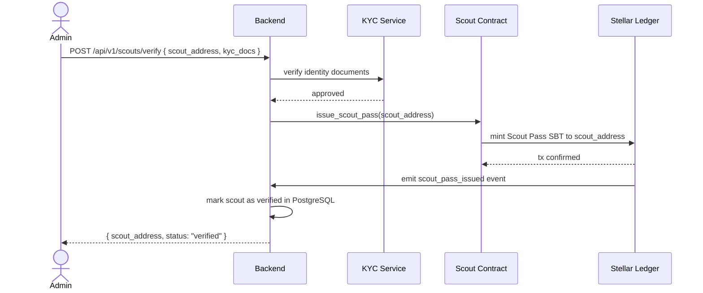
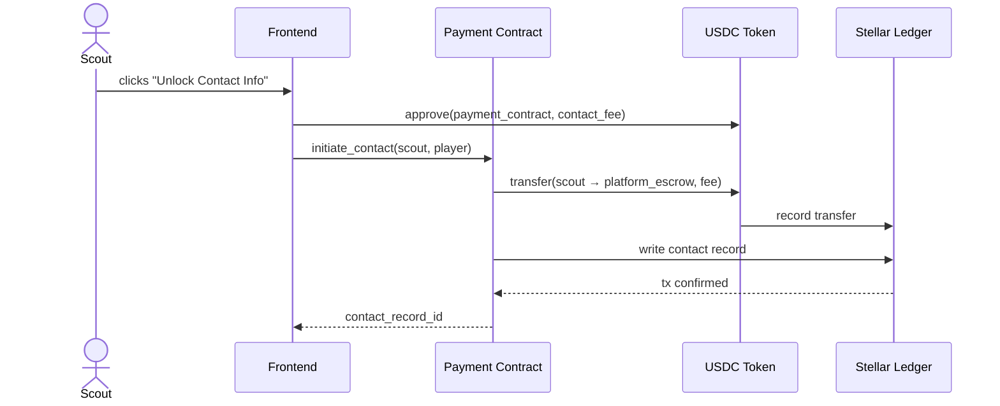

# Data Flow

End-to-end data flows for the three primary user journeys.

---

## 1. Player Registers a Profile



---

## 2. Scout Discovers and Contacts a Player



---

## 3. Admin Issues a Scout Pass



---

## 4. IPFS Hash Integrity Check

When the frontend loads a player profile:

```
1. Frontend calls GET /api/v1/profiles/:address  →  Backend returns cached profile (fast)
2. Frontend also calls Registry Contract get_profile(address)  →  reads ipfs_hash from chain
3. Frontend compares the two hashes
4. If they match  →  render video from IPFS gateway
5. If they differ →  show warning: "Profile data may be stale, on-chain hash is authoritative"
```

The on-chain hash is always the source of truth.

---

## 5. Fee Payment Flow



---

## Cross-Repo Data Dependencies

| Data | Produced by | Consumed by |
|---|---|---|
| `ipfs_hash` | Backend (IPFS upload) | Frontend → Contract |
| `AspirantProfile` | Contract (on-chain) | Backend (event listener) → PostgreSQL → Frontend API |
| `contact_record` | Contract (on-chain) | Backend (event listener) → PostgreSQL |
| `scout_verified` flag | Contract (Scout Pass) | Frontend (gate `initiate_contact` button) |
| Contract IDs | Contract repo (deployment) | Backend `.env`, Frontend `.env` |
| TS bindings | Contract repo (`stellar contract bindings ts`) | Frontend `src/contracts/` |
