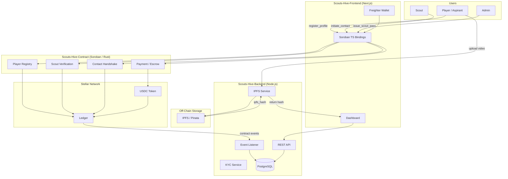

# System Architecture Overview

Scouts Hive is a hybrid Web3 platform. On-chain state lives on Stellar via Soroban smart contracts; heavy media assets live off-chain on IPFS.

## High-Level Diagram

## Layers

| Layer | Repo | Tech |
|---|---|---|
| Smart Contracts | `Scouts-Hive-Contract` | Rust / Soroban |
| Backend Services | `Scouts-Hive-Backend` | TypeScript / Node.js / PostgreSQL |
| Frontend | `Scouts-Hive-Frontend` | TypeScript / Next.js |
| Documentation | `Scouts-Hive-Docs` | Markdown |

## On-Chain vs. Off-Chain

| Concern | Location | Reason |
|---|---|---|
| Player profile metadata | On-chain | Immutable, verifiable, low-cost |
| Video highlight files | IPFS | High bandwidth — blockchain storage is impractical |
| Scout Pass / SBT | On-chain | Access control must be trustless |
| Contact handshake record | On-chain | Cryptographic proof of authorized interaction |
| Fee settlement | On-chain (USDC) | Trustless, instant, near-zero cost |
| Profile cache / search index | PostgreSQL | Fast queries without hitting the ledger |

## Key Design Decisions

- **IPFS hashes on-chain**: Video files are stored on IPFS; only the content hash is written to the contract. This makes the link tamper-evident without storing large blobs on-chain.
- **Soulbound Scout Pass**: The Scout Pass is non-transferable, preventing credential resale or sharing.
- **Incognito by default**: Scouts leave no on-chain trace until they explicitly call `initiate_contact`.
- **TS bindings auto-generated**: `stellar contract bindings ts` generates the frontend contract client after every contract change, keeping the frontend and contract in sync without manual glue code.
- **Event-driven backend**: The backend never polls contract state directly. It listens to ledger events and maintains a synced PostgreSQL cache for fast API responses.

## See Also

- [`ai.md`](../ai.md) — cross-repo connector with env vars and conventions
- [`architecture/data-flow.md`](data-flow.md) — detailed data flow between repos
- [`contracts/soroban-contracts.md`](../contracts/soroban-contracts.md) — contract function reference
